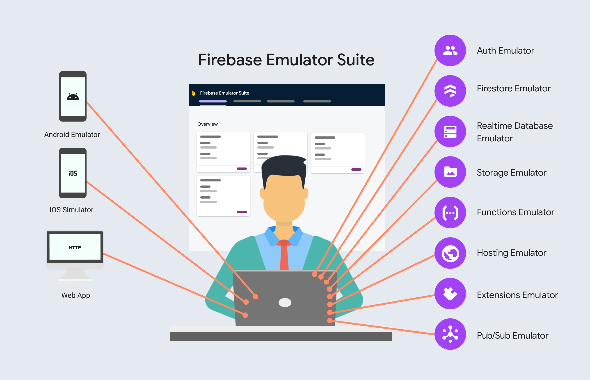
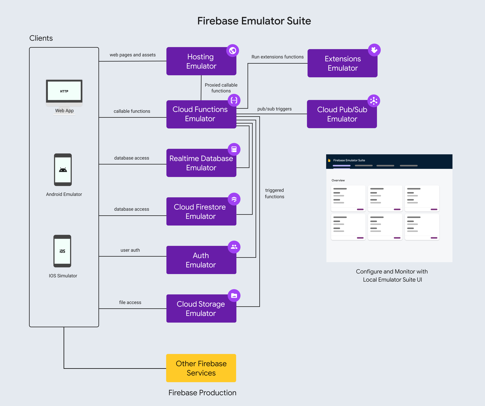

# Tests con Firebase Emulator Suite

Estas pruebas recorren HTTP -> función api -> Flask -> autenticación -> process -> Firestore.
Python actúa como cliente de la API.

Para eso se usa Firebase Emulator Suite que permite correr los servicios de firebase en un entorno local, sin desplegar





## Preparación del entorno

Desde la raíz de grandsafelife-server, instalar Python 3.13, Firebase CLI y Java 21.
Preparar el entorno que Functions espera en venv:

```powershell
python -m venv venv
.\venv\Scripts\python.exe -m pip install -r requirements.txt
```

## Ejecutar automáticamente

```powershell
.\tests\run.ps1
```

El comando inicia los emuladores, corre todos los grupos y los apaga. Devuelve un código
distinto de cero si falla un test. El script verifica herramientas, se ubica en la raíz del
repositorio y devuelve el código de salida de Firebase o Python. No instala dependencias.
Para ejecutar un grupo:

```powershell
.\tests\run.ps1 -Group users
```

Grupos disponibles: `users`, `homes`, `devices`, `devices_stats` o `alarm`.
Si PowerShell bloquea scripts, ejecutar `powershell.exe -NoProfile -ExecutionPolicy Bypass -File .\tests\run.ps1`.
Internamente usa `firebase emulators:exec` con el proyecto fijo `demo-grandsafelife`.

La salida se agrupa con encabezados `Tests - Users`, `Tests - Homes`, etc. Cada caso
se numera dentro de su grupo, muestra su descripción y termina con `Resultado: OK`,
`FALLO` o `ERROR`.

Al final permanece el resumen y el detalle de fallos de unittest.
Los mensajes de Firebase/Flask se intercalan con estos encabezados. En el proyecto
demo local, las actualizaciones inexistentes muestran una línea con Firestore NotFound
y HTTP 500, precedida por la explicación del caso esperado. Otros errores conservan su traceback.

## Mantener el entorno abierto

Terminal 1:

```powershell
firebase emulators:start --project demo-grandsafelife --only auth,firestore,functions
```

Terminal 2:

```powershell
.\tests\run.ps1 -ExistingEmulators
```

Abrir http://127.0.0.1:4000 para navegar por Firestore, administrar usuarios de Auth y ver logs.
La API tiene como base:
`http://127.0.0.1:5001/demo-grandsafelife/us-central1/api/grandsafelife/api/v1`.
También se puede usar Postman con tokens obtenidos de Auth emulado.

Para conservar datos manuales entre sesiones:

```powershell
firebase emulators:start --project demo-grandsafelife --only auth,firestore,functions --export-on-exit=tests/local-data
```

En sesiones posteriores, agregar `--import=tests/local-data` si esa exportación ya existe.
Los tests limpian sus propios documentos; exportar no conserva datos de casos finalizados.

## Aislamiento y datos

El ejecutor rechaza proyectos/hosts incompatibles y exige los tres emuladores en los puertos
configurados. El cliente de Firestore usa credenciales anónimas, un proyecto demo y el host local.
Las peticiones HTTP tienen destinos fijos en 127.0.0.1, sin proxies ni redirecciones.
Cada caso registra un usuario de Auth, obtiene un ID token real del emulador y lo borra al terminar.
Los documentos usan IDs únicos y se eliminan individualmente, sin vaciar la base compartida.
Para métricas, el test carga documentos directamente porque la API solo ofrece lectura.

Functions configura los hosts de Auth y Firestore para el backend. El ejecutor también configura
`GCLOUD_PROJECT`, `GOOGLE_CLOUD_PROJECT`, `FIRESTORE_EMULATOR_HOST` y `FIREBASE_AUTH_EMULATOR_HOST`
para el proceso de pruebas. No usar el comando antiguo `--only functions` para esta suite.
Las reglas incluidas en tests/firestore.rules deniegan clientes directos; Firebase Admin no depende
de esas reglas. La autorización del backend debe probarse en los endpoints cuando se implemente.

## Cobertura y límites

- Users, homes y devices: ID explícito/generado, reemplazo, mapas vacíos, campos omitidos,
  nulos, rutas con puntos, timestamps, lectura inexistente y actualización inexistente.
- Homes y devices: eliminación idempotente y conservación de subcolecciones.
- Users: consulta por email. Devices: filtros por propietario/hogar, hubs y ubicación.
- Stats: diario, mensual, mes anterior, últimos siete días y resultados vacíos.
- Alarms: reemplazo, limpieza con {}, fechas y conservación de campos opcionales.
- Formato de entradas, envelope de respuesta y rechazo de tokens inválidos/ausentes.

Actualmente la actualización de un documento inexistente produce HTTP 500; el test registra
ese comportamiento, pendiente de definir un contrato de error más específico.
Los cálculos de semana/mes usan la fecha local del servidor; los tests usan la misma fecha local
de la PC que ejecuta Functions. Evitar iniciar casos justo al cambiar día/mes.
No incluye detección de caídas, permisos aún pendientes, índices de producción ni comportamiento
real de escalado/IAM. Tras estos tests sigue siendo necesario probar el despliegue en un proyecto de desarrollo.

## Referencias oficiales

- [Auth](https://firebase.google.com/docs/emulator-suite/connect_auth?hl=es-419)
- [Firestore](https://firebase.google.com/docs/emulator-suite/connect_firestore?hl=es-419)
- [Functions](https://firebase.google.com/docs/emulator-suite/connect_functions?hl=es-419)
- [Instalación y ejecución](https://firebase.google.com/docs/emulator-suite/install_and_configure)

